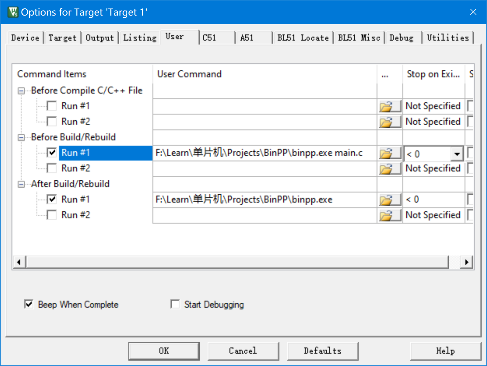

# BinPP

An utility to make C51 recognize binary literals such as `0b10010010`.

## Usage

1. Open Keil uVision.
2. Get to your project.
3. Open the option window of your target.
4. Get to the `User` tab.
5. Edit it .(Follow the picture below)

- In the `Before Build/Rebuild` Tab add your source file name to the arguments of the binpp.exe
- Set the error code to <0

- Have Fun !

## Known Issues

1. uVision may pop up that the source files are changed outside it.(***No Fix***)
2. Binary literals inside string literal,comments,function names , etc will be replaced with hex literal.(***I won't fix this , but PR are welcomed***)

